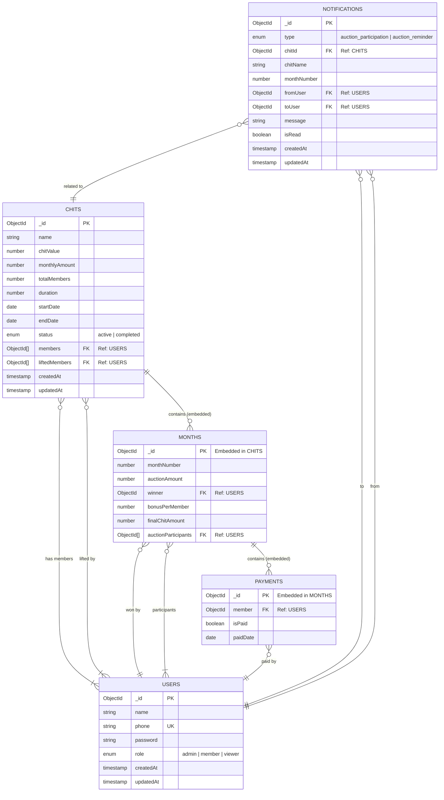

# ER Diagram — Chits-Manager

## Overview

This Entity-Relationship diagram represents the database schema for the Chits-Manager platform. It utilizes MongoDB's flexible schema design, with some relationships embedded (e.g., Months and Payments within Chits) and others referenced (e.g., Users).

---

---

## Schema Details

### Collections

| Collection | Description | Key References |
|------------|-------------|----------------|
| **USERS** | Stores user profiles and authentication data. | - |
| **CHITS** | The core entity. Contains config, members, and lifecycle data. Embeds `MONTHS`. | `members` -> `USERS` |
| **NOTIFICATIONS** | Stores system alerts and messages for users. | `toUser` -> `USERS`, `chitId` -> `CHITS` |

### Embedded Documents

| Entity | Parent | Description |
|--------|--------|-------------|
| **MONTHS** | `CHITS` | Represents a specific month/round of the chit. Stores auction data. |
| **PAYMENTS** | `MONTHS` | Represents the payment status for each member for that specific month. |

### Relationships

-   **Users & Chits**: Many-to-Many. A user can be in multiple chits, and a chit has multiple users.
-   **Chit & Month**: One-to-Many (Embedded). A chit has exactly `duration` number of months.
-   **Month & Payment**: One-to-Many (Embedded). A month has `totalMembers` payment records.
