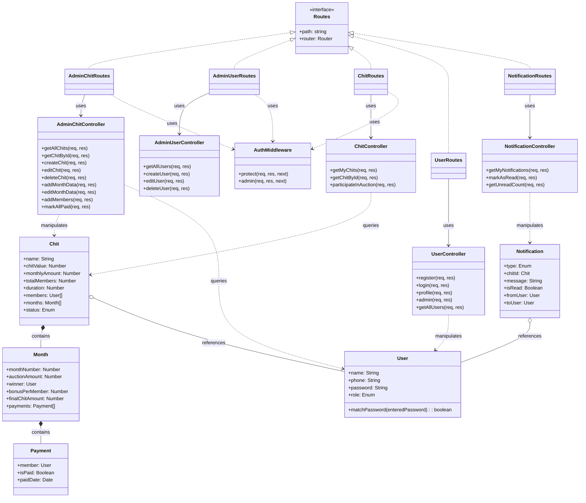

# Class Diagram — Chits-Manager

## Overview

This class diagram illustrates the backend structure of the Chits-Manager application, following the **MVC (Model-View-Controller)** pattern with TypeScript. It highlights the relationships between Routes, Controllers, Models, and Middleware.

---

---

## Architecture Components

### Controllers
Handle the incoming HTTP requests, process business logic (often delegating to services or interacting directly with models), and return responses.
-   `AdminChitController`: Manages chit lifecycle (Creation, Auctions, Payments).
-   `ChitController`: Handles member-specific read operations and actions.
-   `UserController`: Authentication and profile management.

### Models
Define the data structure and schema using Mongoose.
-   `User`: Handles authentication and profile data.
-   `Chit`: Complex aggregate root containing embedded Months and Payments.
-   `Notification`: Ephemeral user alerts.

### Interfaces & Routes in TypeScript
-   `Routes` interface ensures all route classes (`AdminChitRoutes`, etc.) follow a consistent structure.
-   `AuthMiddleware` is injected into routes to secure endpoints.
