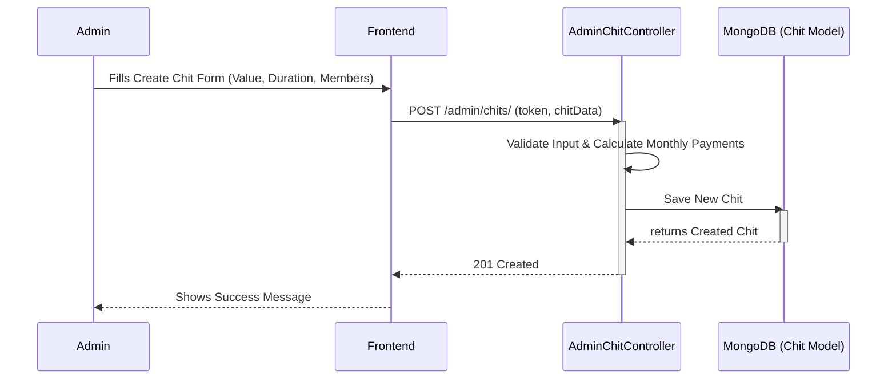
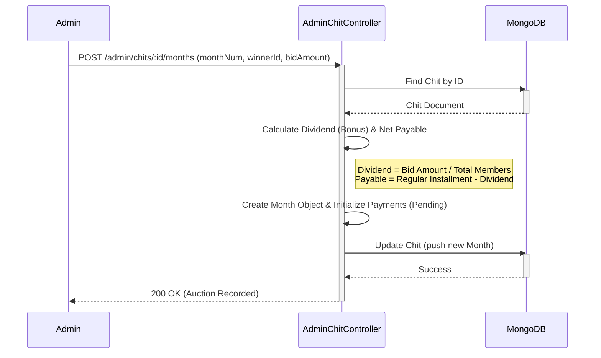
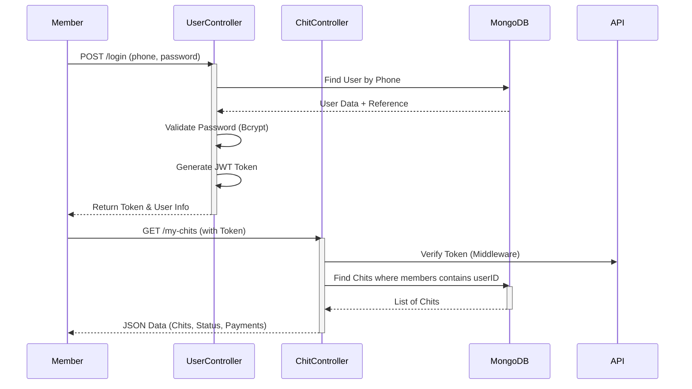

# Sequence Diagram — Chits-Manager

## Overview

These sequence diagrams depict key workflows in the Chits-Manager system, illustrating the interaction between Users (Admin/Member), the API/Controller layer, and the Database.

---

## 1. Create New Chit Group (Admin)

---

## 2. Record Auction Result (Admin)

This flow occurs when an auction is held for a specific month, and the admin records the winner and bid amount.

---

## 3. Member Login & View Dashboard

