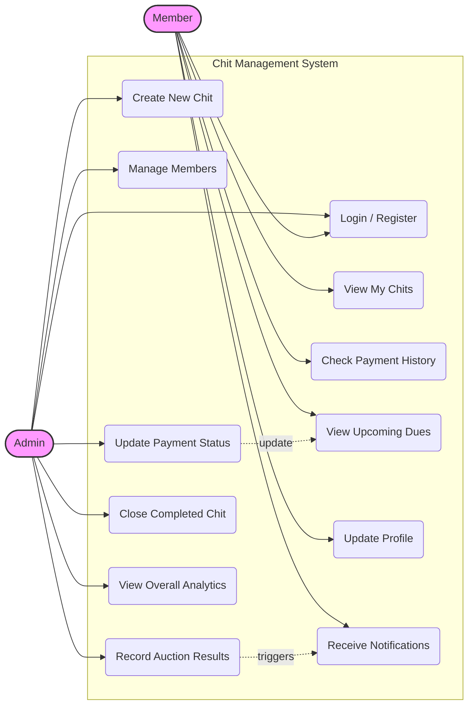

# Use Case Diagram — Chits-Manager

## Overview

This diagram captures the functional requirements of the system, categorized by the actors (Admin and Member) who interact with the Chits-Manager platform.

---

---

## Detailed Use Cases

### Admin
1.  **Create New Chit**: Setup a new financial group, defining value, duration, and adding participating members.
2.  **Record Auction**: Monthly task to input the winner and bid amount, triggering automated calculations for everyone's payable amount.
3.  **Update Payment Status**: Mark members as "Paid" when offline payment is received.

### Member
1.  **View My Chits**: See a list of all active and completed chits they are part of.
2.  **Check Upcoming Dues**: See exactly how much they owe for the current month (Regular installment - Dividend).
3.  **Payment History**: Verify that their previous payments have been correctly recorded by the admin.
